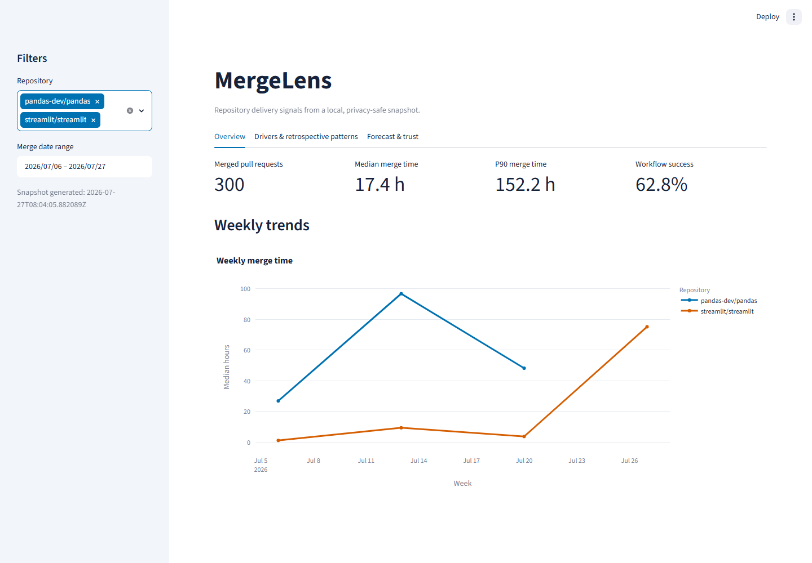

# MergeLens

`engineering-intelligence-dashboard` is a tested portfolio project that turns a small,
privacy-minimized public GitHub snapshot into delivery metrics, retrospective bottleneck views,
and an honestly evaluated merge-time forecast.

## Problem

Delivery data is easy to collect and easy to overclaim. Teams need a compact way to inspect flow
without exposing developer identities, confusing correlation with causation, or presenting a
model as better than a simple baseline when it is not.

## 30-second value

Open one local Streamlit app to compare repository delivery signals, explore recent merge-time
patterns, and test an opening-time forecast. The committed demo works offline after installation:
300 merged pull requests and 199 completed workflow runs from two public repositories are already
included. The fixed holdout is evaluated with only labels available at its cutoff; on this
snapshot, the random forest has lower MAE than the baseline.

## Agentic engineering with Codex, Sol, and Ultra reasoning

This finishing pass used Codex running GPT-5.6 Sol with Ultra reasoning
(`Codex + Sol + Ultra`). It is one scoped part of the current evidence-hardening workflow.
It does not claim that every historical change or subagent used the same model or reasoning level.

A coordinator uses task decomposition to give scoped implementation agents bounded changes.
Git worktrees and commit boundaries isolate concurrent scopes; agents return diffs and test
evidence, and read-only independent review agents report findings without mutating the branch.

The loop is test-first: state the contract, capture RED, add the smallest implementation, and
capture GREEN before broader gates. Local RED evidence for this change was `1 failed, 7 passed`
when the required README section was absent. A separate mutation-style RED against the
signature-and-size-only screenshot validator was `2 failed, 8 deselected`: it accepted both a
corrupt PNG and a valid 1440x999 PNG. Pillow decode/verify plus the exact 1440x1000 check made the
same two cases GREEN at `2 passed, 8 deselected`.

The binding anchors are `tests/test_project_contract.py`, `.github/workflows/ci.yml`,
`requirements-dev.txt`, and [AGENTS.md](AGENTS.md). The local gate combines Ruff, pytest, and
coverage; GitHub Actions runs the same commands in CI. Playwright visual QA exercises the running
browser separately. Gate output is labeled local, CI, or live and still requires human approval
before merge, push, or deployment.

Agent and reviewer interactions are designed around known failure modes: diff review catches
hallucinated changes, mutation-proven negative cases expose weak tests, and SHA/environment labels
surface drift between local, CI, and live.
Guardrails require no secret output and no developer scoring. Evidence, not AI claims, proves
completion; an agent's status report is never sufficient.

See [Agentic development](docs/agentic-development.md) for the vertical-slice record and
[AGENTS.md](AGENTS.md) for the binding repository constraints.

## Features

- **Overview:** merged pull-request count, median and P90 merge time, workflow success, and
  weekly trends with shared repository/date filters.
- **Drivers & retrospective patterns:** high-contrast Plotly views of change size, merge delay,
  and repository medians, labeled as retrospective and non-causal.
- **Forecast & trust:** an opening-time-only random-forest forecast shown beside its train-median
  baseline, each held-out MAE, time-safe training/test/purged counts, feature importance, and an
  explicit non-causal-use warning.

## Live demo

[Open the Streamlit deployment](https://engineering-intelligence-dashboard-jq9xccatzgwy9y9hcrwmor.streamlit.app/).

On 2026-07-27, an anonymous HTTP check returned **HTTP 303** and redirected to
`share.streamlit.io/-/auth/app`. The deployment is currently **auth-gated**, so it is not yet a
recruiter-accessible public showcase. The app owner must make it public and reboot it in Streamlit.

GitHub Actions [passed the complete quality gate](https://github.com/ktubi970/engineering-intelligence-dashboard/actions/runs/30282867104/job/90033339637)
on commit `82e86b2fedc2526f6fc1eff6ce27941efbe0a00b`: **170 passed** with **94.54%**
coverage. The job ran lint, format checking, and the test suite on Linux with Python 3.13.



The screenshot is a genuine 1440x1000 capture from the locally running application.

## Metric definitions

- **Merged pull requests:** rows with a positive duration from UTC creation to UTC merge time.
- **Median merge time:** the middle `merge_hours` value; **P90 merge time** is the 90th percentile
  using linear interpolation.
- **Average weekly throughput:** the mean merged-PR count across observed UTC Monday-based weekly
  buckets.
- **Workflow success:** successful conclusions divided by completed workflow runs with a recorded
  conclusion.
- **MAE:** mean absolute error in hours on the newest fixed chronological test rows. Lower is
  better. Earlier candidates train only when their merge label was available strictly before the
  test cutoff.

## Architecture

GitHub collection is separate from the offline app: public API responses are normalized with
pandas, written as validated local CSV/JSON snapshot files, then loaded by metrics, model, Plotly,
and Streamlit layers. See [Architecture](docs/architecture.md) for the flow, contracts,
dependencies, and failure modes.

## Installation

Python 3.13 is the CI runtime. From a checked-out repository:

```powershell
python -m venv .venv
.\.venv\Scripts\Activate.ps1
python -m pip install -r requirements-dev.txt
```

On macOS or Linux, activate with `source .venv/bin/activate`.

## Offline demo

The app reads only `data/snapshots` by default and makes no network request:

```powershell
streamlit run streamlit_app.py
```

Use the sidebar to filter repositories and an inclusive UTC date range. The forecast remains
available only when at least 80 pull-request rows are selected.

## Optional data refresh

Refreshing is explicit and is the only normal path that calls GitHub. It accepts public
`owner/repository` slugs, rejects private repositories before collection, and can use an optional
`GITHUB_TOKEN` environment variable without storing or printing it.

```powershell
python scripts/refresh_data.py
```

Use `--repo owner/repository` repeatedly and `--limit-per-repo N` to choose sources and bounds.
Review generated data before committing it.

## Tests

The local and CI quality contract is:

```powershell
python -m ruff check .
python -m ruff format --check .
python -m pytest --cov=engineering_intelligence --cov-report=term-missing --cov-fail-under=85
```

Tests use fixtures or committed local data and make no network calls. Task-by-task local and
hosted results are recorded in [Quality evidence](docs/quality-evidence.md); a workflow is not
proof that GitHub Actions has passed.

## Model results

The committed 300-row pull-request snapshot is stable-sorted by `created_at`.
The newest 20% (60 rows) is a fixed chronological holdout.
Its earliest opening time is the as-of cutoff.
Of the 240 earlier candidates, 223 have labels available before the cutoff; 17 are purged.

- As-of cutoff: **2026-07-20T18:48:28+00:00**
- Time-safe training rows: **223**
- Chronological test rows: **60**
- Purged unavailable labels: **17**
- Training-median estimate: **18.235 hours**
- Random-forest MAE: **17.499891193309 hours**
- Training-median baseline MAE: **20.535763888889 hours**
- Winner: **random forest**, by **3.035872695580 hours**

The random forest has lower MAE than the baseline on this fixed snapshot. This single holdout does
not establish future or general superiority, so both estimates and both empirical MAEs remain
visible. Inputs are only repository, pull-request number, and UTC calendar features derived from
creation time. The target is estimated merge time among pull requests that eventually merge.
This is an experimental, non-causal estimate and never a developer score. See the
[Model card](docs/model-card.md).

## Limitations

The snapshot is recent, point-in-time, and limited to two public open-source repositories. It
contains merged pull requests rather than every opened pull request, so it has selection and
survivorship bias. Repository process changes and future data may shift results. Feature
importance and the size/delay plot describe patterns; neither identifies causes.

## Privacy

The committed snapshot excludes developer names, logins, email addresses, avatars, pull titles,
pull bodies, comments, revision hashes, and credentials. It keeps public repository slugs,
repository-scoped numeric identifiers, aggregate lengths/counts, timestamps, status categories,
and a non-identifying author-association category. See the [Data card](docs/data-card.md).

## License

MergeLens is available under the [MIT License](LICENSE).
